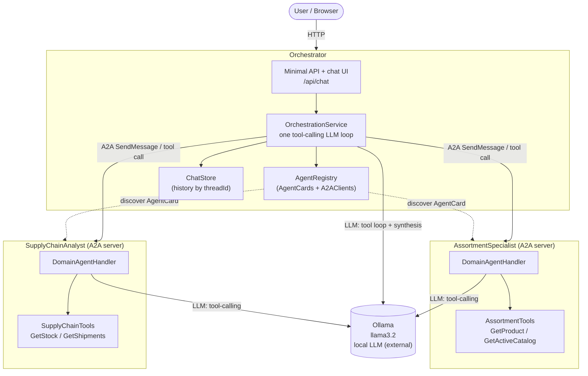
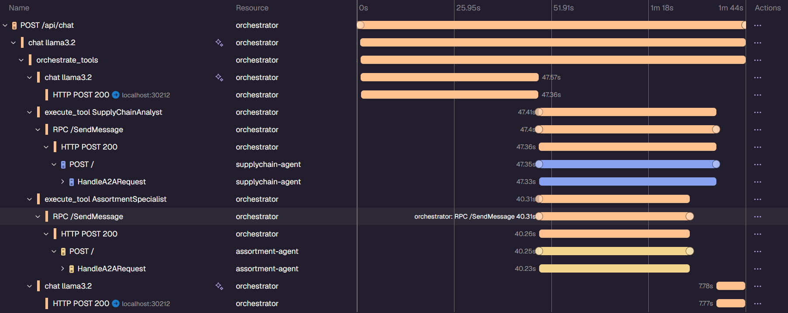

# A2A Multi-Agent Orchestrator
A .NET 10 PoC for the A2A. **Orchestrator** discovers **agents** over HTTP, exposes each as a tool to one LLM loop, and aggregate to one response. All LLM inference runs locally through **Ollama** (`llama3.2`).

## Architecture



See [`docs/architecture.md`](docs/architecture.md) for diagrams and the full request flow, and
[`AGENTS.md`](AGENTS.md) for conventions.

## How it works

There is no separate route → dispatch → aggregate pipeline. Each discovered agent's `AgentCard` becomes
an `AIFunction` tool; one `FunctionInvokingChatClient` loop decides which agents to call (concurrently),
calls them via `A2AClient.SendMessageAsync`, and merges the results. A down agent degrades gracefully.
Chat history is kept per `threadId` in `ChatStore` and replayed into the LLM context.

## Project layout

```
src/
  AppHost/            .NET Aspire host — boots agents + orchestrator, injects agent URLs + Ollama env
  ServiceDefaults/    Shared OpenTelemetry, health, resilience wiring
  Orchestrator/       Minimal API + chat UI + the pipeline (OrchestrationService, AgentRegistry, ChatStore)
  Agent.Assortment/   A2A server — catalog / product specialist (AssortmentSpecialist)
  Agent.SupplyChain/  A2A server — warehouse stock / shipment specialist (SupplyChainAnalyst)
  Shared/             Service names + model id
docs/architecture.md  Diagrams: topology, message flow, chat history, tracing
```

## Prerequisites

- [.NET 10 SDK](https://dotnet.microsoft.com/download)
- A running Ollama with a tool-calling model. Aspire does **not** start Ollama — run it yourself first:
  ```bash
  docker run -d --name ollama -p 11434:11434 -v ollama:/root/.ollama ollama/ollama
  docker exec -it ollama ollama pull llama3.2
  ```

## Configuration

| Variable | Default | Purpose |
|----------|---------|---------|
| `OLLAMA_ENDPOINT` | `http://localhost:11434` | Ollama base URL. Must support tool calling. |
| `OLLAMA_MODEL` | `llama3.2` | Model used by the orchestrator and agents. |

`AppHost` reads `OLLAMA_ENDPOINT` from `aspire.config.json` (adjust it to your instance) and injects it
plus the resolved agent URLs into all services.

## Run

Start Ollama first (see above), then:

```bash
dotnet build
dotnet run --project src/AppHost      # whole system via Aspire — opens the dashboard
```

Open the Aspire dashboard link printed on startup for endpoints, logs, and traces. The chat UI is at
the orchestrator's `/`; the API is `POST /api/chat` (`{ threadId?, message }` → `{ threadId, answer }`).

There is no test project in this repo.

> If a build fails with a file-lock error (`MSB3021`/`MSB3027`), a previous Aspire run is still holding
> the output. Stop it (Ctrl+C or from the dashboard) and rebuild.

## Observability

Every service wires OpenTelemetry via `AddServiceDefaults()`, producing one distributed trace tree per
`/api/chat` request in the Aspire dashboard's **Traces** tab: the orchestrator's LLM loop
(`orchestrate_tools`) calls both agents (`execute_tool <Name>` → `RPC /SendMessage` → the agent's
`POST /`) concurrently, each continuing the same trace, then a final synthesis `chat` call.



## Adding a new domain agent

1. Copy `src/Agent.Assortment` as a template; give it an `AgentCard` with an accurate
   `Description`/`Skills` (this is what the orchestrator LLM routes on).
2. Register it in `AppHost.cs` and add its URL to the orchestrator's `AGENTS__<n>` list.
3. Add a `ServiceNames` entry in `src/Shared`.
