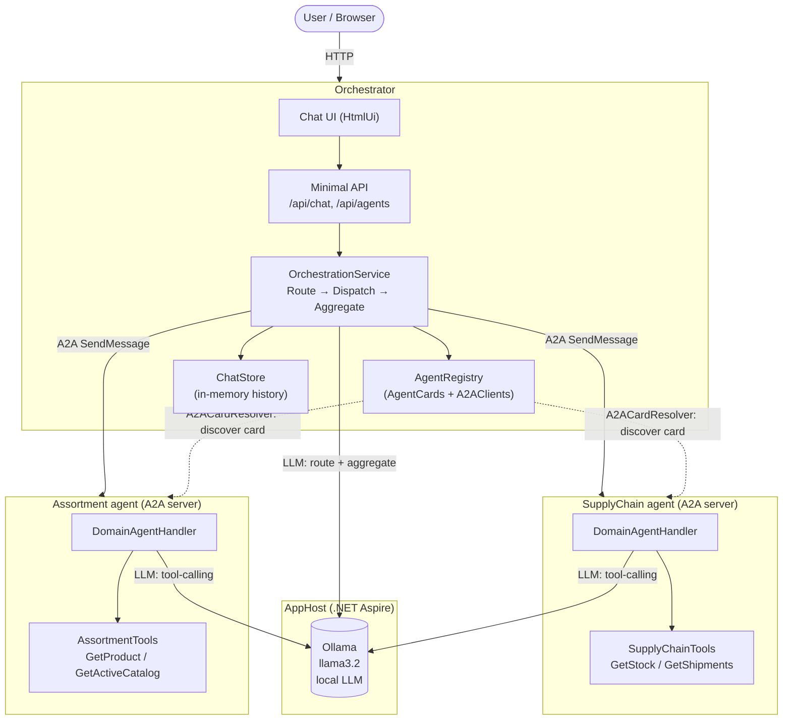
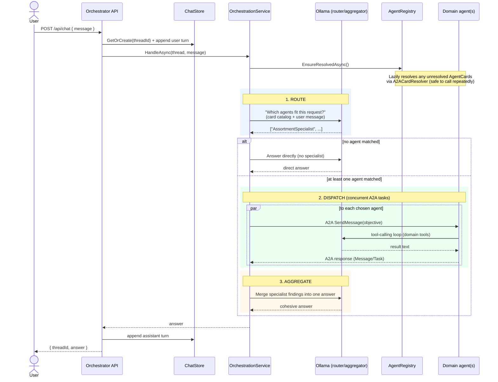
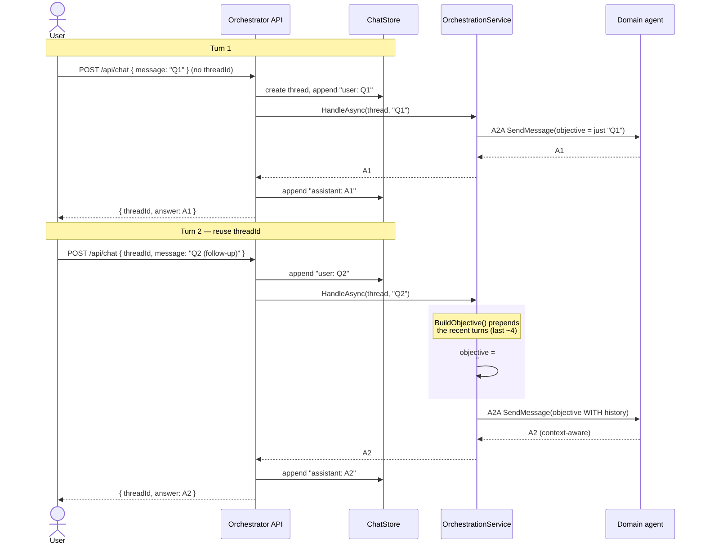
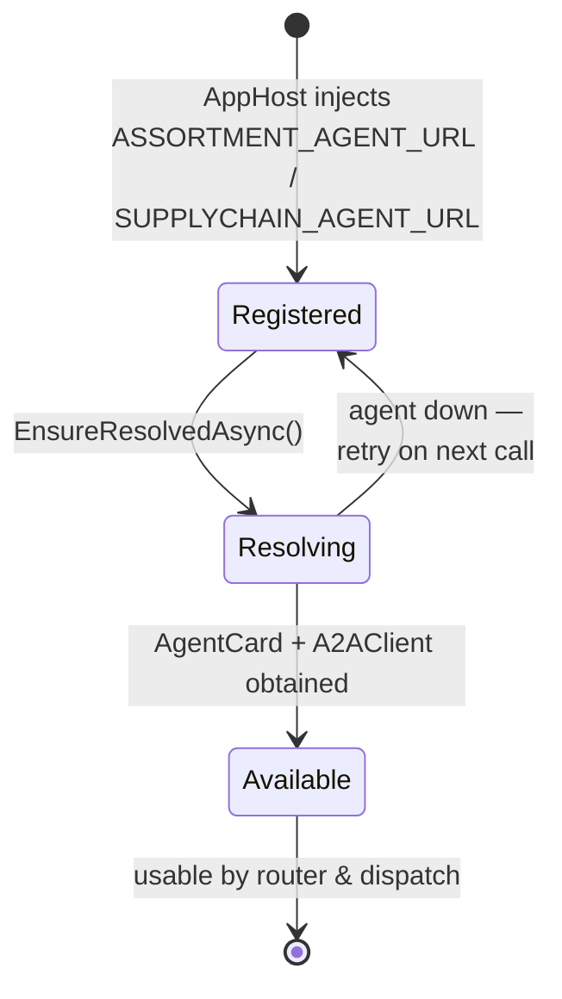

# A2A Multi-Agent Commerce Orchestrator — Architecture

This solution demonstrates the [Agent-to-Agent (A2A) protocol](https://a2aproject.github.io/A2A/) in
.NET. A central **Orchestrator** discovers independent **domain agents** over HTTP, routes each user
request to the relevant specialists, dispatches A2A tasks concurrently, and merges the findings into a
single answer. All LLM inference runs locally through **Ollama**.

## Components

| Component | Project | Role |
|-----------|---------|------|
| **AppHost** | `src/AppHost` | .NET Aspire host. Boots Ollama, both agents, and the orchestrator; injects agent URLs. |
| **ServiceDefaults** | `src/ServiceDefaults` | Shared Aspire wiring: OpenTelemetry (traces/metrics/logs) exported to the dashboard, health checks, HTTP resilience, service discovery. |
| **Orchestrator** | `src/Orchestrator` | Minimal API + chat UI. Owns routing, dispatch, aggregation, and chat history. |
| **Orchestrator.Core** | `src/Orchestrator.Core` | `OrchestrationService`, `AgentRegistry`, `ChatStore` — the reusable pipeline. |
| **Assortment agent** | `src/Agent.Assortment` | A2A server. Catalog / product / store-coverage specialist. |
| **SupplyChain agent** | `src/Agent.SupplyChain` | A2A server. Warehouse stock / shipment / velocity specialist. |
| **Shared** | `src/Shared` | Well-known Aspire service names and the model id. |

Each agent publishes an **AgentCard** (name, description, skills, capabilities) at its
`/.well-known` endpoint. The orchestrator resolves those cards through `A2ACardResolver` and uses them
as the catalog the router LLM chooses from.

## System topology

## Flow A — a single client message

What happens end to end when a user sends one message and one or more specialists are needed.

Key points:

- **Route** — a router LLM call selects agents purely from their published AgentCards. Zero, one, or
  many agents may be chosen. Zero matches falls back to a direct orchestrator answer.
- **Dispatch** — chosen agents run **concurrently** via `Task.WhenAll`. Each agent is a real A2A
  server; the orchestrator talks to it with `A2AClient.SendMessageAsync`. A failed agent degrades
  gracefully (its dispatch returns an "unavailable" note instead of throwing).
- **Aggregate** — an aggregator LLM call merges the specialist outputs into one answer, resolving
  overlaps and hiding the fact that multiple agents were involved.

## Flow B — an ongoing conversation (chat history)

Every request reuses the same `threadId`, so history accumulates in `ChatStore`. Before dispatching,
the orchestrator builds an **objective** that includes recent conversation context, so specialists
answer follow-up questions coherently.

Notes on history handling:

- The **orchestrator** owns cross-turn history in `ChatStore` (keyed by `threadId`). The full thread is
  the source of truth for the conversation.
- `BuildObjective()` slices the recent turns (`TakeLast(5).SkipLast(1)`) and embeds them into the task
  objective sent to agents — agents themselves stay stateless per call from the orchestrator's view.
- Each A2A agent independently keeps its own per-context task history
  (`options.AutoAppendHistory = true` + `InMemoryTaskStore`), which is used inside a single agent task,
  separate from the orchestrator's conversation store.

## Discovery & resolution lifecycle

`IsAvailable` is `true` only once both the `AgentCard` and the `A2AClient` are set. Resolution is lazy
and idempotent, so an agent that starts slowly (or restarts) is picked up on the next request without
crashing the orchestrator.

## Observability (traces)

Every service calls `AddServiceDefaults()` (from `src/ServiceDefaults`), which wires OpenTelemetry
for traces, metrics, and logs. Under Aspire, the AppHost injects `OTEL_EXPORTER_OTLP_ENDPOINT` into
each service, so all telemetry is exported to the **Aspire dashboard** — open it, pick a service, and
go to the **Traces** tab.

What you see per `/api/chat` request, as one distributed trace tree:

- The inbound ASP.NET Core span for `POST /api/chat` (auto-instrumented).
- A custom `orchestrate.handle` span (from the `A2A.Orchestrator` `ActivitySource`) tagged with the
  thread id, user message, and available agents.
- An `orchestrate.history` child span tagged with the thread's total turn count and how many prior
  turns were replayed into the LLM context — so "the orchestrator works with history" is visible.
- A `chat <model>` span (e.g. `chat llama3.2`, from the `Experimental.Microsoft.Extensions.AI`
  source) for the **router/aggregator LLM call**: the model deciding which agent tools to invoke and
  later merging their outputs. It carries `gen_ai.request.model`, `gen_ai.system`, and (with
  `EnableSensitiveData = true`) the prompt and the model's tool-call/finish details — so you can see
  exactly which Ollama model was called.
- An `orchestrate_tools` span (from the same source, emitted by `FunctionInvokingChatClient`) wrapping
  the tool-call loop, plus a custom `dispatch <AgentName>` child span per agent the LLM invokes, tagged
  with the request, success flag, and error status on failure.
- An `orchestrate.aggregate` span tagged with the final answer length.
- The outbound HttpClient spans for each A2A call, which continue into the **agent's own** ASP.NET
  Core spans (trace context propagates across the A2A HTTP hop) — so a single trace spans the
  orchestrator and every specialist it called.

Inside each specialist agent the same trace continues:

- A custom `<agent>.handle_task` span (from `A2A.Agent.Assortment` / `A2A.Agent.SupplyChain`) tagged
  with the task/context id, objective, and result length.
- A `chat <model>` span for the **sub-agent's own LLM invocation** (again showing the Ollama model
  in the span name), plus an `orchestrate_tools` span wrapping the sub-agent's private domain tool
  calls (`GetProduct`, `GetStock`, ...) — so "every sub agent invokes the LLM and the LLM invokes
  tools" is visible end to end.

Custom spans are captured because `ServiceDefaults` registers `AddSource("A2A*")`; name any new
`ActivitySource` with an `A2A` prefix to have it show up automatically. LLM/tool spans are captured
because `ServiceDefaults` also registers `AddSource("Experimental.Microsoft.Extensions.AI")` (the
source name Microsoft.Extensions.AI actually uses), and each chat client is built with
`.UseOpenTelemetry(o => o.EnableSensitiveData = true)`.
