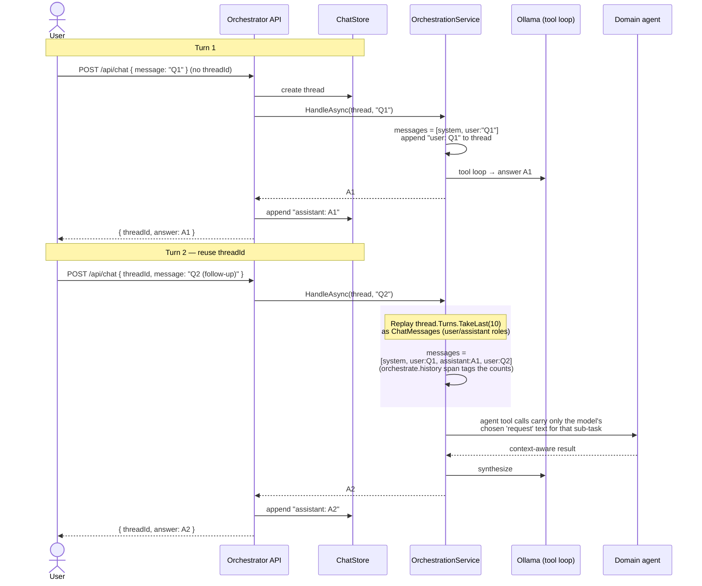
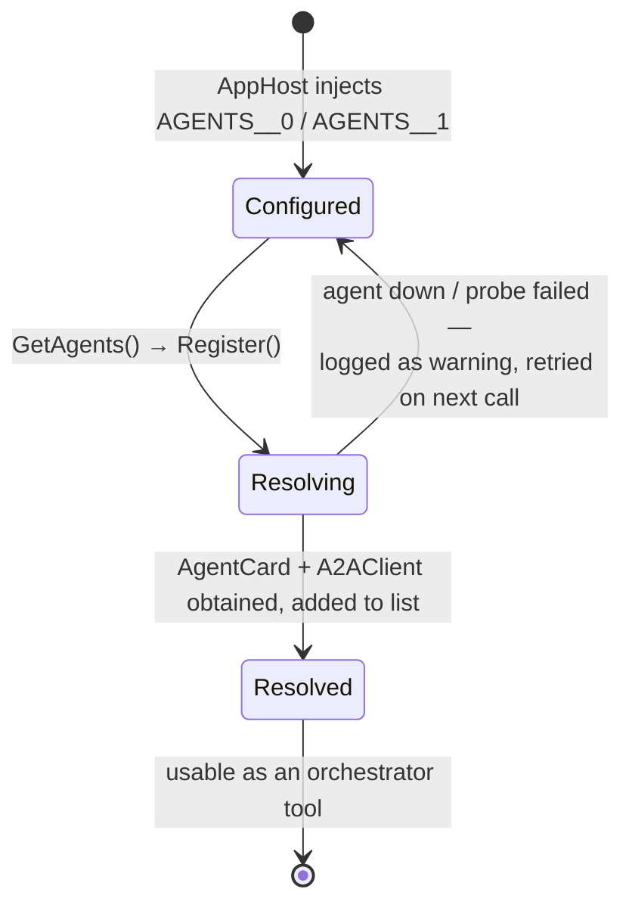

# A2A Multi-Agent Commerce Orchestrator — Architecture

This solution demonstrates the [Agent-to-Agent (A2A) protocol](https://a2aproject.github.io/A2A/) in
.NET. A central **Orchestrator** discovers independent **domain agents** over HTTP, exposes each one as
a callable tool to a single function-calling LLM loop, and lets the model call whichever specialists it
needs (in parallel) before synthesizing one answer. All LLM inference runs locally through **Ollama**.

## Design in one sentence

There is no explicit route → dispatch → aggregate pipeline. Every available agent is wrapped as an
`AIFunction` tool on one `FunctionInvokingChatClient`, and a single LLM loop decides which agent tools
to call, calls them (concurrently, on demand), and merges the results into one answer.

## Components

| Component | Project | Role |
|-----------|---------|------|
| **AppHost** | `src/AppHost` | .NET Aspire host. Boots both agents and the orchestrator; injects agent URLs and the Ollama endpoint/model. Does **not** start Ollama. |
| **ServiceDefaults** | `src/ServiceDefaults` | Shared Aspire wiring: OpenTelemetry (traces/metrics/logs) exported to the dashboard, health checks, HTTP resilience, service discovery. |
| **Orchestrator** | `src/Orchestrator` | Minimal API + chat UI. Owns the tool-calling loop, agent discovery, and chat history. |
| **Assortment agent** | `src/Agent.Assortment` | A2A server. Catalog / product / active-assortment specialist. Card name: `AssortmentSpecialist`. |
| **SupplyChain agent** | `src/Agent.SupplyChain` | A2A server. Warehouse stock / shipment / velocity specialist. Card name: `SupplyChainAnalyst`. |
| **Shared** | `src/Shared` | Well-known Aspire service names and the model id. |

Each agent publishes an **AgentCard** (name, description, skills, capabilities) at
`/.well-known/agent-card.json`. The orchestrator resolves those cards through `A2ACardResolver` and
turns each into a tool the orchestrator LLM can call.

## System topology

```mermaid
graph TB
    Ollama[("Ollama<br/>llama3.2<br/>local LLM (external)")]

    User([User / Browser]) -->|HTTP| Orch

    subgraph Orch["Orchestrator"]
        UI["Chat UI (HtmlUi)"]
        API["Minimal API<br/>/api/chat, /api/agents, /"]
        Svc["OrchestrationService<br/>one tool-calling LLM loop"]
        Reg["AgentRegistry<br/>(AgentCards + A2AClients)"]
        Store["ChatStore<br/>(in-memory history)"]
        UI --> API --> Svc
        Svc --> Reg
        Svc --> Store
    end

    Svc -->|LLM: tool loop + synthesis| Ollama

    subgraph Assort["AssortmentSpecialist (A2A server)"]
        AH["DomainAgentHandler"]
        AT["AssortmentTools<br/>GetProduct / GetActiveCatalog"]
        AH --> AT
    end
    subgraph Supply["SupplyChainAnalyst (A2A server)"]
        SH["DomainAgentHandler"]
        ST["SupplyChainTools<br/>GetStock / GetShipments"]
        SH --> ST
    end

    Reg -.->|A2ACardResolver: discover card| Assort
    Reg -.->|A2ACardResolver: discover card| Supply
    Svc -->|A2A SendMessage (as a tool call)| Assort
    Svc -->|A2A SendMessage (as a tool call)| Supply
    AH -->|LLM: tool-calling| Ollama
    SH -->|LLM: tool-calling| Ollama
```

`AppHost` injects `OLLAMA_ENDPOINT` / `OLLAMA_MODEL` into all three services and the agent base URLs
(`AGENTS__0`, `AGENTS__1`) into the orchestrator, and `WaitFor`s both agents so first-contact card
resolution doesn't race a cold agent.

## Flow A — a single client message

What happens end to end when a user sends one message and one or more specialists are needed.

```mermaid
sequenceDiagram
    actor User
    participant API as Orchestrator API
    participant Store as ChatStore
    participant Svc as OrchestrationService
    participant Reg as AgentRegistry
    participant LLM as Ollama (tool loop)
    participant Agent as Domain agent(s)

    User->>API: POST /api/chat { message }
    API->>Store: GetOrCreate(threadId)
    API->>Svc: HandleAsync(thread, message)

    Svc->>Reg: GetAgents()
    Note over Reg,Agent: Resolves any unresolved AgentCards via<br/>A2ACardResolver (lazy; safe to call again)
    Reg-->>Svc: RemoteAgent[] (Card + A2AClient)

    Svc->>Svc: Build tools = one AIFunction per agent<br/>(name + description from the AgentCard)
    Svc->>Svc: messages = [system] + last 10 turns + user

    rect rgb(235, 244, 255)
    Note over Svc,Agent: Single FunctionInvokingChatClient loop<br/>(≤10 iterations, concurrent invocation)
    Svc->>LLM: GetResponseAsync(messages, tools)
    loop until the model stops calling tools
        LLM-->>Svc: tool call(s): Agent(request = "…")
        par each requested agent (may be concurrent)
            Svc->>Agent: A2A SendMessage(request)
            Agent->>LLM: agent's own tool-calling loop (domain tools)
            LLM-->>Agent: result text
            Agent-->>Svc: A2A response (Message/Task) → extracted text
        end
        Svc->>LLM: tool results fed back into the loop
    end
    LLM-->>Svc: final synthesized answer
    end

    Svc-->>API: answer
    API->>Store: append assistant turn
    API-->>User: { threadId, answer }
```

Key points:

- **No separate route/dispatch/aggregate calls.** The model is given every agent as a tool and the
  system prompt tells it to call *every* relevant domain (e.g. both supply-chain and assortment for a
  stock-and-catalog question). Zero, one, or many tool calls may happen; if none is relevant the model
  answers directly.
- **Dispatch = a tool call.** Each agent tool invokes `A2AClient.SendMessageAsync(request, Role.User)`.
  `AllowConcurrentInvocation = true` lets multiple agent calls in one turn run in parallel.
- **Graceful degradation.** A failing agent tool catches the exception and returns
  `"(agent unavailable: …)"` so one down agent never crashes the turn.
- **Synthesis.** The same loop, after tools return, produces one cohesive plain-text answer, forbidden
  by the system prompt from inventing prices/quantities or naming which agent said what.

## Flow B — an ongoing conversation (chat history)

Every request reuses the same `threadId`, so history accumulates in `ChatStore`. The orchestrator
replays the last turns into the LLM message list as **real chat messages** (not embedded into a task
"objective" string), so the model has direct conversational context.



Notes on history handling:

- The **orchestrator** owns cross-turn history in `ChatStore` (keyed by `threadId`); the full thread is
  the source of truth for the conversation. `HandleAsync` appends the user turn; the `/api/chat`
  endpoint appends the assistant turn after `HandleAsync` returns.
- History is `thread.Turns.TakeLast(10)`, added to the LLM message list as `user`/`assistant`
  `ChatMessage`s. The `orchestrate.history` span records `a2a.history.total_turns` and
  `a2a.history.replayed_turns`.
- What each agent receives is only the `request` string the model chose for that tool call — the
  orchestrator does not forward the whole conversation to agents. Each A2A agent independently keeps
  its own per-context task history (`options.AutoAppendHistory = true` + `InMemoryTaskStore`), used
  inside a single agent task and separate from the orchestrator's conversation store.

## Discovery & resolution lifecycle

`AgentRegistry` binds the injected `AGENTS` URL array and resolves each agent's `AgentCard` through
`A2ACardResolver`, storing a `RemoteAgent(Card, A2AClient)` per successfully resolved agent.



- `Register()` iterates the configured URLs, probes each card, and adds resolved agents to an internal
  list. A failed probe is logged as a warning and simply skipped (no crash).
- `GetAgents()` returns the cached list if non-empty, otherwise calls `Register()` — so resolution is
  lazy and re-attempted while the list is still empty. (Note: once at least one agent resolves, the
  list is non-empty and `GetAgents()` returns it without re-probing the still-missing agents; a
  restart is needed to pick those up.)
- Card probes use the dedicated `agent-direct` HttpClient: a 5-minute timeout with the standard
  resilience handler removed, because its 10s per-attempt timeout was aborting first-contact card
  probes against a cold agent.

## Observability (traces)

Every service calls `AddServiceDefaults()` (from `src/ServiceDefaults`), which wires OpenTelemetry for
traces, metrics, and logs, and registers these trace sources:

- the app's own `ApplicationName` source,
- `A2A*` (wildcard) — the A2A SDK transport spans (`A2A`, `A2A.AspNetCore`) plus any custom `A2A.*`
  `ActivitySource`,
- `Experimental.Microsoft.Extensions.AI` — the LLM `chat` spans and automatic tool-call spans.

Under Aspire, the AppHost injects `OTEL_EXPORTER_OTLP_ENDPOINT` into each service, so all telemetry is
exported to the **Aspire dashboard** — open it, pick a service, and go to the **Traces** tab.

What you see per `/api/chat` request, as one distributed trace tree:

```
POST /api/chat (Server)                  auto-instrumented ASP.NET Core span
  orchestrate.history (Internal)         A2A.Orchestrator — the only custom orchestrator span
  chat <model>                           the tool-calling LLM loop (Experimental.Microsoft.Extensions.AI)
    <tool call spans>                    FunctionInvokingChatClient invoking each agent tool
      <A2A client + HttpClient spans>    per-agent A2A call; W3C traceparent injected over HTTP
        POST / (Server)                  the remote agent continues the SAME trace
          chat <model>                   the agent's own LLM + private domain-tool loop
```

Details and honest caveats:

- The orchestrator emits exactly **one** custom span, `orchestrate.history` (from the
  `A2A.Orchestrator` `ActivitySource`), tagged with `a2a.history.total_turns` and
  `a2a.history.replayed_turns`. There is **no** `orchestrate.handle` root span, **no**
  `orchestrate.aggregate` span, and **no** explicit `dispatch <Agent>` span — the per-agent dispatch is
  a plain `LogInformation` line inside the tool function, not an `Activity`.
- The `chat <model>` and tool-call spans come from `Experimental.Microsoft.Extensions.AI`, captured
  because each chat client is built with `.UseOpenTelemetry(o => o.EnableSensitiveData = true)`. With
  sensitive data on, these carry the prompt and the model's tool-call/finish details.
- **OTel is the outermost chat-client decorator.** In `OrchestrationService`, the chat client is a
  `FunctionInvokingChatClient` wrapped by `.UseOpenTelemetry(...)` (OTel first = outermost), so OTel
  observes the whole tool loop, not just a bare LLM call. `Orchestrator/Program.cs` therefore does
  **not** call `UseFunctionInvocation` — the service owns the single loop.
- **Trace stitching across the A2A hop** relies on the A2A SDK's client spans plus HttpClient
  instrumentation propagating `traceparent`, so the remote agent's inbound ASP.NET Core span (and its
  own `chat`/tool spans) join the same trace.
- The domain agents currently emit **no custom spans** (there is no `handle_task` `ActivitySource`);
  they only log. Their trace contribution is the ASP.NET Core inbound span, the A2A SDK server spans,
  and their own Extensions.AI `chat`/tool spans. To add an `A2A.Agent.<Name>` `handle_task` span, give
  the handler its own `ActivitySource` with an `A2A` prefix — it will be captured by the `A2A*`
  wildcard automatically.
